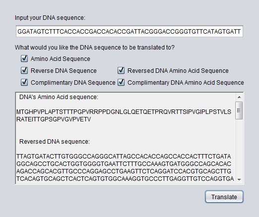

## DNA-to-Protein

Many researchers in the field of biology find it increasingly useful to use computer programming to analyze and process data. For example, a molecular biologist may want to identify the protein associated with the gene (DNA sequence) they have isolated in the lab.  This is because DNA itself is just a series of nucleobases, adenine (A), thymine (T), guanine (G) and cytosine (C). In order for the DNA code to have a physiological impact on the organism, the code must be translated into functional proteins that catalyze reactions to support life.  The DNA code is translated by reading every three nucleotides called a codon (i.e. ATG) in the DNA sequence and translate into an amino acid (ATG = M for Methionine)

##### For example, the DNA sequence: 
3' end
```bash
TACCACGTGGACTGAGGACTCCTCTTCAGACGCCAATGACGGGACACCCCGTTCCACTTGCACCTACTTCAACCACCACTCCGGGACCCGTCCGACGACCACCAGATGGGAACCTGGGTCTCCAAGAAACTCAGGAAACCCCTAGACAGGTGAGGACTACGTCAATACCCGTTGGGATTCCACTTCCGAGTACCGTTCTTTCACGAGCCACGGAAATCACTACCGGACCGAGTGGACCTGTTGGAGTTCCCGTGGAAACGGTGTGACTCACTCGACGTGACACTGTTCGACGTGCACCTAGGACTCTTGAAGTCCGAGGACCCGTTGCACGACCAGACACACGACCGGGTAGTGAAACCGTTTCTTAAGTGGGGTGGTCACGTCCGACGGATAGTCTTTCACCACCGACCACACCGATTACGGGACCGGGTGTTCATAGTGATT
```
5' end

##### Translates into the amino acid sequence:
```bash
MTGHPVPLAPTSTTTPGPVRRPPDGNLGLQETQETPRQVRTTSIPVGIPLPSTVLSRATEITTGPSGPVGVPVETV
```

This is the beta subunit of hemoglobin. Hemoglobin is a protein in red blood cells that transports oxygen throughout the body.

The purpose of this project is to allow the user to input a DNA sequence and return an amino acid sequence (a potential protein) using either the direct input DNA, its complementary, or reverse sequence. The user can then use the output for DNA functionality studies, DNA or amino acid alignment for phylogenetic analyses and so forth.



## License
[MIT](https://choosealicense.com/licenses/mit/)
